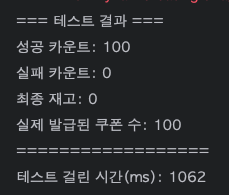

# 동시성 문제

위 문서에서는 동시성 문제는 무엇이며, 해당 문제가 왜 발생하는지 깊게 학습하며 정리한 문서입니다.

해당 문
서는 다음과 같은 목차로 진행됩니다.

1. 동시성 문제 재현 및 이해
2. 비관적 락
3. 낙관적
4. Redis 분산 락  Lettuce
5. Redis 분산 락 Redisson

## 예제

쿠폰을 발급하는 로직을 작성하고 해당 쿠폰을 동시에 여러 명의 사용자가 발급을 요청하는 상황을 예제로 선택하였습니다.

```java
@Service
@RequiredArgsConstructor
public class BasicCouponService implements CouponService{

    private final CouponRepository couponRepository;
    private final CouponIssueRepository issueRepository;

    @Transactional
    public void issue(Long userId, Long couponId) {
        Coupon coupon = couponRepository.findById(couponId)
                .orElseThrow(() -> new IllegalArgumentException("쿠폰을 찾을 수 없습니다."));

        if (coupon.getStock() <= 0) {
            throw new IllegalArgumentException("쿠폰 재고가 없습니다.");
        }

        coupon.decrease();

        issueRepository.save(new CouponIssue(1L, userId));
    }

    @Transactional(readOnly = true)
    public Integer getStock(Long couponId) {
        Coupon coupon = couponRepository.findById(couponId)
                .orElseThrow(() -> new IllegalArgumentException("쿠폰을 찾을 수 없습니다"));

        return coupon.getStock();
    }
}
```

간단히 설명하면 `issue()` 메서드는 쿠폰을 발급하는 역할을 수행합니다.

이때 다음 과정을 통해 쿠폰을 발급합니다.

1. 요청 파라미터로 들어온 쿠폰 ID를 이용하여 실제 쿠폰이 존재하는지 조회합니다.
2. 해당 쿠폰에 재고가 남아 있는지 확인합니다.
3. 쿠폰의 재고를 1 감소시킵니다.
4. 어떤 사용자가 쿠폰을 발급 받았는지 확인하기 위해 CouponIssue를 저장합니다.

## 테스트 결과

테스트는 2가지 시나리오를 통해 진행하였습니다.

1. 100명의 사용자가 동시 접근할 때
2. 1000명의 사용자가 동시 접근할 때

1번 쿠폰의 재고가 100개이기 때문에 1번 테스트 시나리오에서는 100개의 쿠폰 발급을 기대하였고,

2번째 테스트에서는 100개의 쿠폰 발급 성공과 900개의 요청은 쿠폰 발급 실패를 기대하였습니다.

### 시나리오1

```java
    @Test
    @DisplayName("1000명이 동시에 100개 쿠폰 발급 - 재고 초과 방지 확인")
    void concurrentIssueWithOverStockTest() throws InterruptedException {
        // given
        int threadCount = 1000;
        ExecutorService executorService = Executors.newFixedThreadPool(32);
        CountDownLatch latch = new CountDownLatch(threadCount);

        AtomicInteger successCount = new AtomicInteger(0);
        AtomicInteger failCount = new AtomicInteger(0);

        // 테스트 시간 측정하기
        long startTime = System.nanoTime();

        // when
        for (int i = 0; i < threadCount; i++) {
            long userId = i;
            executorService.submit(() -> {
                try {
                    couponService.issue(userId, 1L);
                    successCount.incrementAndGet();
                } catch (Exception e) {
                    failCount.incrementAndGet();
                } finally {
                    latch.countDown();
                }
            });
        }

        latch.await();
        executorService.shutdown();

        long endTIme = System.nanoTime();
        long testTime = (endTIme - startTime) / 1_000_000;

        // then
        Thread.sleep(1000);

        Coupon coupon = couponRepository.findById(1L).orElseThrow();
        long issuedCount = couponIssueRepository.count();

        System.out.println("=== 재고 초과 테스트 결과 ===");
        System.out.println("요청 수: " + threadCount);
        System.out.println("성공 카운트: " + successCount.get());
        System.out.println("실패 카운트: " + failCount.get());
        System.out.println("최종 재고: " + coupon.getStock());
        System.out.println("실제 발급된 쿠폰 수: " + issuedCount);
        System.out.println("===========================");
        System.out.println("테스트 걸린 시간(ms): " + testTime);
    }
```


실제 결과를 확인해보니 쿠폰 10개가 발급되었습니다.

### 시나리오2

```java
@Test
    @DisplayName("1000명이 동시에 100개 쿠폰 발급 - 재고 초과 방지 확인")
    void concurrentIssueWithOverStockTest() throws InterruptedException {
        // given
        int threadCount = 1000;
        ExecutorService executorService = Executors.newFixedThreadPool(32);
        CountDownLatch latch = new CountDownLatch(threadCount);

        AtomicInteger successCount = new AtomicInteger(0);
        AtomicInteger failCount = new AtomicInteger(0);

        // 테스트 시간 측정하기
        long startTime = System.nanoTime();

        // when
        for (int i = 0; i < threadCount; i++) {
            long userId = i;
            executorService.submit(() -> {
                try {
                    couponService.issue(userId, 1L);
                    successCount.incrementAndGet();
                } catch (Exception e) {
                    failCount.incrementAndGet();
                } finally {
                    latch.countDown();
                }
            });
        }

        latch.await();
        executorService.shutdown();

        long endTIme = System.nanoTime();
        long testTime = (endTIme - startTime) / 1_000_000;

        // then
        Thread.sleep(1000);

        Coupon coupon = couponRepository.findById(1L).orElseThrow();
        long issuedCount = couponIssueRepository.count();

        System.out.println("=== 재고 초과 테스트 결과 ===");
        System.out.println("요청 수: " + threadCount);
        System.out.println("성공 카운트: " + successCount.get());
        System.out.println("실패 카운트: " + failCount.get());
        System.out.println("최종 재고: " + coupon.getStock());
        System.out.println("실제 발급된 쿠폰 수: " + issuedCount);
        System.out.println("===========================");
        System.out.println("테스트 걸린 시간(ms): " + testTime);
    }
```


테스트 결과 재고는 모두 소진되었으나 995개의 쿠폰이 발급되었다는 결과가 나왔습니다.

## 결론

이처럼 쿠폰 발급 시 동시에 예상하지 못한 사용자 요청이 발생했을 때 결과 또한 예상한 결과가 아니었습니다.

이러한 문제를 동시성 문제임을 알게 되었고, 해결 방법에 대해 고민해보았습니다.

## 동시성 문제란?

동시성 문제란 여러 작업이 동시에 실행될 때 발생할 수 있는 예상치 못한 문제를 의미합니다.

공유 자원에 여러 스레드, 혹은 여러 요청이 동시에 발생하게 되면서 해당 문제가 발생하게 됩니다.

### 발생 원인

동시성 이유가 발생하는 이유는 바로 Context Switching과 연관이 있습니다.


현재 쿠폰 지급 시스템은 크게 3가지 동작으로 이루어집니다.

1. 쿠폰이 있는지 확인한다.
2. 쿠폰을 지급하고 재고를 감소시킨다.
3. 위 변경 사항을 DB에 저장한다.

이때 2번째 그림에서 DB에 반영하기 전에 컨텍스트 스위칭이 발생하게 되었고, 결과적으로 재고는 총 2개가 감소해야 하지만, 결과적으로 1개만 감소한 것을 확인할 수 있습니다.

# 해결 방법

## 1. 비관적 락 (**Pessimistic Lock**)

동시성을 제어할 때 Lock을 사용하면 동시성 문제를 간단하게 해결할 수 있습니다.

```java
public interface CouponRepository extends JpaRepository<Coupon, Long> {

    @Lock(LockModeType.PESSIMISTIC_WRITE)
    @Query("SELECT c FROM Coupon  c WHERE c.id = :id")
    Optional<Coupon> findByIdWithPessimisticLock(@Param("id") Long id);
}
```

위와 같이 쿠폰을 조회할 때 `@Lock(LockModeType.PESSIMISTIC_WRITE)` 설정을 통해 비관적 락 설정을 하였습니다.

```java
@Service
@RequiredArgsConstructor
public class PessimisticCouponService implements CouponService{

    private final CouponRepository couponRepository;
    private final CouponIssueRepository issueRepository;

    @Transactional
    public void issue(Long userId, Long couponId) {
        Coupon coupon = couponRepository.findByIdWithPessimisticLock(couponId)
                .orElseThrow(() -> new IllegalArgumentException("쿠폰을 찾을 수 없습니다."));

        if (coupon.getStock() <= 0) {
            throw new IllegalArgumentException("쿠폰 재고가 없습니다.");
        }

        coupon.decrease();

        issueRepository.save(new CouponIssue(1L, userId));
    }

    @Transactional(readOnly = true)
    public Integer getStock(Long couponId) {
        Coupon coupon = couponRepository.findByIdWithPessimisticLock(couponId)
                .orElseThrow(() -> new IllegalArgumentException("쿠폰을 찾을 수 없습니다"));

        return coupon.getStock();
    }
}
```

해당 로직을 서비스 코드에 반영한 뒤 다시 동일한 테스트를 실행시켰습니다.

### 테스트 결과




결과적으로 1번째 테스트와 2번째 테스트 모두 정상적으로 작동한 것을 확인하였습니다.

2번째 테스트 경우 쿠폰이 100개가 있었기 때문에 정상적으로 900개의 요청이 실패하였습니다.

## 2. 낙관적 락

이번에는 낙관적 락 방법을 통해 동시성 문제를 해결해보겠습니다.

```java
@Getter
@Entity
@Builder
@NoArgsConstructor
@AllArgsConstructor
@Table(name = "coupon")
public class Coupon {

    @Id
    private Long id;

    @Column(nullable = false)
    private int stock;

    @Version
    private Long version;

    public void decrease() {
        this.stock -= 1;
    }
}
```

낙관적 락은 Version을 통해 동시성을 제어하기 때문에 version 필드를 생성하였습니다.

```java
public interface CouponRepository extends JpaRepository<Coupon, Long> {

    @Lock(LockModeType.PESSIMISTIC_WRITE)
    @Query("SELECT c FROM Coupon  c WHERE c.id = :id")
    Optional<Coupon> findByIdWithPessimisticLock(@Param("id") Long id);

    @Lock(LockModeType.OPTIMISTIC)
    @Query("SELECT c FROM Coupon c WHERE c.id = :id")
    Optional<Coupon> findByIdWithOptimisticLock(@Param("id") Long id);
}
```

낙관적 락을 사용하여 쿠폰을 조회하는 로직을 추가하였습니다.

```java
@Primary
@Service
@RequiredArgsConstructor
public class OptimisticCouponService implements CouponService{

    private final CouponRepository couponRepository;
    private final CouponIssueRepository issueRepository;

    @Transactional
    public void issue(Long userId, Long couponId) {
        Coupon coupon = couponRepository.findByIdWithOptimisticLock(couponId)
                .orElseThrow(() -> new IllegalArgumentException("쿠폰을 찾을 수 없습니다."));

        if (coupon.getStock() <= 0) {
            throw new IllegalArgumentException("쿠폰 재고가 없습니다.");
        }

        coupon.decrease();

        issueRepository.save(new CouponIssue(1L, userId));
    }

    @Transactional(readOnly = true)
    public Integer getStock(Long couponId) {
        Coupon coupon = couponRepository.findByIdWithOptimisticLock(couponId)
                .orElseThrow(() -> new IllegalArgumentException("쿠폰을 찾을 수 없습니다"));

        return coupon.getStock();
    }
}
```

방금 구현한 로직을 사용하는 서비스 코드를 작성하였고, 빈 우선 순위는 `@Primary`를 이용하여 제어했습니다.

### 테스트 결과

```java
2026-01-04T14:47:59.901+09:00  WARN 56832 --- [concurrency-coupon] [ool-2-thread-23] org.hibernate.orm.session                : HHH90010101: Closing shared session with unprocessed transaction completion actions
발급 실패: Unexpected row count (expected row count 1 but was 0) [update coupon set stock=?,version=? where id=? and version=?] for entity [com.normaldev.concurrencycoupon.entity.Coupon with id '1']
2026-01-04T14:47:59.902+09:00  WARN 56832 --- [concurrency-coupon] [pool-2-thread-5] org.hibernate.orm.session                : HHH90010101: Closing shared session with unprocessed transaction completion actions
발급 실패: Unexpected row count (expected row count 1 but was 0) [update coupon set stock=?,version=? where id=? and version=?] for entity [com.normaldev.concurrencycoupon.entity.Coupon with id '1']
```


2번째 테스트 시나리오는 정상적으로 통과하였습니다.

하지만 1번째 테스트에서 실패 카운트가 87개가 나오게 되었고, 실패 원인 로그는 위와 같습니다.

이때 성공 카운트와 실패 카운트 합이 100이 되는 걸로 봐서 정합성은 지켜지는 것을 확인하였습니다.

하지만 왜 실패했을까요?

## 낙관적 락과 비관적 락

먼저 둘의 차이를 알아야 합니다.

### 차이점

- 비관적 락
    - 이름 그대로 충돌이 날 것을 비관적으로 바라보며, 충돌 자체를 안 나게 설정
    - 데이터를 읽는 순간 DB row에 락을 설정함
    - 다른 트랜잭션은 락이 풀릴 때까지 대기하게 됨
    - 따라서 충돌 자체가 발생하지 않는다!
- 낙관적 락
    - 이름 그대로 충돌은 거의 없을 것으로 바라보며, 충돌이 발생하면 실패 처리함
    - 락을 걸지 않는다
    - 대시 version 필드를 통해 변경을 감지한다.

따라서 낙관적 락을 걸었을 때 실패 카운트와 실패 로그가 발생한 이유는 다음과 같습니다.

- 100명이 동시에 같은 version 값을 읽는다.
- 거의 동시에 update를 시도한다.
- 이때 전부 성공하지 못하고 1명만 성공하고 나머지는 실패하게 된다.

그렇다면 낙관적 락은 어떻게 처리해야 할까요?

바로 재시도 처리를 해야 합니다.

## 낙관적 락 재시도 처리

```java
@Primary
@Service
@RequiredArgsConstructor
public class OptimisticCouponService implements CouponService{

    private final CouponRepository couponRepository;
    private final CouponIssueRepository issueRepository;

    @Override
    @Retryable(
            retryFor = ObjectOptimisticLockingFailureException.class,
            maxAttempts = 10,
            backoff = @Backoff(delay = 10)
    )
    @Transactional
    public void issue(Long userId, Long couponId) {
        Coupon coupon = couponRepository.findByIdWithOptimisticLock(couponId)
                .orElseThrow(() -> new IllegalArgumentException("쿠폰을 찾을 수 없습니다."));

        if (coupon.getStock() <= 0) {
            throw new IllegalArgumentException("쿠폰 재고가 없습니다.");
        }

        coupon.decrease();

        issueRepository.save(new CouponIssue(1L, userId));
    }

    @Recover
    public void recover(
            ObjectOptimisticLockingFailureException e, Long userId, Long couponId
    ) {
        throw new IllegalStateException("쿠폰 발급 재시도 초과", e);
    }
```

재시도 처리 방식은 `Spring Retry` 라이브러리를 사용하였습니다.

서비스 코드를 보면 재시도 최대 횟수와 backoff 시간을 설정할 수 있습니다.

초기에는 모두 10으로 설정하였습니다.

### 테스트 결과


재시도 처리를 하지 않았을 때보다는 성공 카운트가 크게 올랐으나, 여전히 실패 카운트가 존재했습니다.

이는 첨부한 사진에서 확인할 수 있듯이 쿠폰 발급 재시도 횟수를 초과했기 때문에 `@Recover`에서 이를 예외를 던져 처리를 했기 때문이었습니다.

여러 스레드가 충돌하였을 때 재시도 타이밍이 또 겹치게 되면서 다시 충돌이 발생한 것으로 판단하였습니다.

이를 해결하기 위해 재시도 횟수나 backoff 설정 값을 조절했습니다.

### 낙관적 락 정리

**장점:**
- DB 락을 사용하지 않아 성능상 이점이 있다
- 충돌이 적은 환경에서 효율적이다

**단점:**
- 충돌이 빈번한 경우 재시도가 많이 발생한다
- 재시도 로직을 직접 구현해야 한다
- 재시도 횟수와 대기 시간 튜닝이 필요하다

## 3. Redis 분산 락 - Lettuce

비관적 락과 낙관적 락은 모두 DB 레벨에서 동시성을 제어하는 방식입니다.

하지만 실제 프로덕션 환경에서는 여러 대의 서버가 동시에 운영되는 경우가 많습니다.

이런 경우 DB 락만으로는 서버 간 동시성 제어가 불가능합니다.

따라서 Redis를 이용한 분산 락을 구현하여 여러 서버 환경에서도 동시성을 제어할 수 있도록 했습니다.

### Lettuce 구현

Lettuce는 Spring Data Redis의 기본 Redis 클라이언트입니다.

Redis의 `SETNX` 명령어를 이용하여 분산 락을 구현할 수 있습니다.
```java
@Service
@RequiredArgsConstructor
public class LettuceCouponService implements CouponService {

    private final CouponRepository couponRepository;
    private final CouponIssueService couponIssueService;
    private final RedisTemplate redisTemplate;

    private static final String LOCK_KEY_PREFIX = "coupon:lock:";
    private static final long LOCK_TIMEOUT_SECONDS = 3L;
    private static final long RETRY_DELAY_MS = 50L;
    private static final int MAX_RETRY_COUNT = 100;

    @Override
    public void issue(Long userId, Long couponId) {
        String lockKey = LOCK_KEY_PREFIX + couponId;

        if (!acquireLock(lockKey)) {
            throw new IllegalArgumentException("락 획득에 실패하였습니다. 잠시 후 다시 시도해주세요");
        }

        try {
            couponIssueService.issue(userId, couponId);
        } finally {
            releaseLock(lockKey);
        }
    }

    private boolean acquireLock(String key) {
        int retryCount = 0;

        while (retryCount < MAX_RETRY_COUNT) {
            Boolean success = redisTemplate.opsForValue()
                    .setIfAbsent(key, "locked", Duration.ofSeconds(LOCK_TIMEOUT_SECONDS));

            if (Boolean.TRUE.equals(success)) {
                return true;
            }

            retryCount++;

            try {
                Thread.sleep(RETRY_DELAY_MS);
            } catch (InterruptedException e) {
                Thread.currentThread().interrupt();
                throw new IllegalArgumentException("락 획득 중 인터럽트 발생", e);
            }
        }

        return false;
    }

    private void releaseLock(String key) {
        Boolean deleted = redisTemplate.delete(key);
        if (Boolean.TRUE.equals(deleted)) {
            log.debug("락 해제 성공: {}", key);
        }
    }
}
```

### Lettuce 동작 방식

1. `setIfAbsent()` 메서드로 Redis에 키가 없을 때만 값을 설정 (SETNX)
2. 락 획득에 성공하면 비즈니스 로직 수행
3. 락 획득에 실패하면 일정 시간 대기 후 재시도
4. 비즈니스 로직 완료 후 락 해제 (DELETE)

### 테스트 결과


두 테스트 모두 정상적으로 100개의 쿠폰이 발급되었습니다.

### Lettuce 방식의 특징

**장점:**
- Spring Data Redis의 기본 클라이언트로 별도 의존성 추가 불필요
- 구현이 비교적 간단함
- Redis의 기본 명령어만 사용

**단점:**
- 스핀 락(Spin Lock) 방식으로 락 획득 시도를 반복하여 Redis에 부하 발생
- 재시도 로직을 직접 구현해야 함
- 락 타임아웃 관리를 직접 해야 함

## 4. Redis 분산 락 - Redisson

Redisson은 Redis 기반의 자바 클라이언트로, Lettuce보다 고급 기능을 제공합니다.

특히 분산 락 구현에 있어서 Pub/Sub 방식을 사용하여 효율적입니다.

### Redisson 의존성 추가
```gradle
implementation 'org.redisson:redisson-spring-boot-starter:3.25.0'
```

### Redisson 설정
```java
@Configuration
public class RedisConfig {

    @Value("${spring.data.redis.host}")
    private String host;

    @Value("${spring.data.redis.port}")
    private int port;

    @Bean
    public RedissonClient redissonClient() {
        Config config = new Config();
        config.useSingleServer()
                .setAddress("redis://" + host + ":" + port)
                .setConnectionPoolSize(50)
                .setConnectionMinimumIdleSize(10)
                .setRetryAttempts(3)
                .setRetryInterval(1500);

        return Redisson.create(config);
    }
}
```

### Redisson 구현
```java
@Service
@RequiredArgsConstructor
public class RedissonCouponService implements CouponService {

    private final CouponRepository couponRepository;
    private final CouponIssueService couponIssueService;
    private final RedissonClient redissonClient;

    private static final String LOCK_KEY_PREFIX = "coupon:lock:";
    private static final long WAIT_TIME_SECONDS = 5L;
    private static final long LEASE_TIME_SECONDS = 3L;

    @Override
    public void issue(Long userId, Long couponId) {
        String lockKey = LOCK_KEY_PREFIX + couponId;
        RLock lock = redissonClient.getLock(lockKey);

        try {
            boolean available = lock.tryLock(WAIT_TIME_SECONDS, LEASE_TIME_SECONDS, TimeUnit.SECONDS);

            if (!available) {
                throw new IllegalStateException("쿠폰 발급 요청이 많습니다. 잠시 후 다시 시도해주세요.");
            }

            couponIssueService.issue(userId, couponId);

        } catch (InterruptedException e) {
            Thread.currentThread().interrupt();
            throw new IllegalStateException("쿠폰 발급 중 인터럽트 발생", e);
        } finally {
            if (lock.isHeldByCurrentThread()) {
                lock.unlock();
            }
        }
    }
}
```

### Redisson 동작 방식

1. `tryLock()` 메서드로 락 획득 시도
    - `waitTime`: 락을 기다릴 최대 시간
    - `leaseTime`: 락을 자동으로 해제할 시간 (Deadlock 방지)
2. 락 획득 실패 시 Pub/Sub을 통해 락 해제 알림을 받음 (스핀 락 방지)
3. 비즈니스 로직 수행
4. `finally` 블록에서 락 해제

### 테스트 결과


두 테스트 모두 정상적으로 100개의 쿠폰이 발급되었습니다.

### Redisson vs Lettuce 비교

| 특징 | Lettuce | Redisson |
|------|---------|----------|
| 락 획득 방식 | 스핀 락 (Spin Lock) | Pub/Sub |
| Redis 부하 | 높음 (지속적인 재시도) | 낮음 (이벤트 기반) |
| 구현 복잡도 | 재시도 로직 직접 구현 | 간단 (라이브러리 제공) |
| 락 자동 해제 | 직접 구현 필요 | 자동 제공 (Lease Time) |
| 성능 | 상대적으로 낮음 | 상대적으로 높음 |
| 의존성 | 기본 포함 | 추가 필요 |

### Redisson의 장점

**장점:**
- Pub/Sub 방식으로 Redis 부하 최소화
- 락 자동 연장 기능 (Watch Dog)
- Deadlock 방지를 위한 자동 해제 기능
- 재시도 로직을 직접 구현할 필요 없음
- 다양한 분산 자료구조 제공

**단점:**
- 추가 의존성 필요
- Lettuce보다 상대적으로 무거움

### 성능 비교 분석

1. **비관적 락**: DB 락으로 인한 대기 시간 발생
2. **낙관적 락**: 충돌 시 재시도로 인한 오버헤드
3. **Lettuce**: 스핀 락 방식으로 인한 Redis 부하
4. **Redisson**: Pub/Sub 방식으로 가장 효율적

## 결론 및 권장사항

### 각 방식의 적용 시나리오

1. **비관적 락**
    - 단일 서버 환경
    - 충돌이 매우 빈번한 경우
    - 데이터 정합성이 최우선인 경우

2. **낙관적 락**
    - 단일 서버 환경
    - 충돌이 드문 경우
    - 읽기 작업이 많은 경우

3. **Lettuce (Redis 분산 락)**
    - 다중 서버 환경
    - Redis만 사용 가능한 환경
    - 간단한 분산 락이 필요한 경우

4. **Redisson (Redis 분산 락)**
    - 다중 서버 환경
    - 높은 동시성 처리가 필요한 경우
    - 프로덕션 환경에서의 안정적인 분산 락 구현